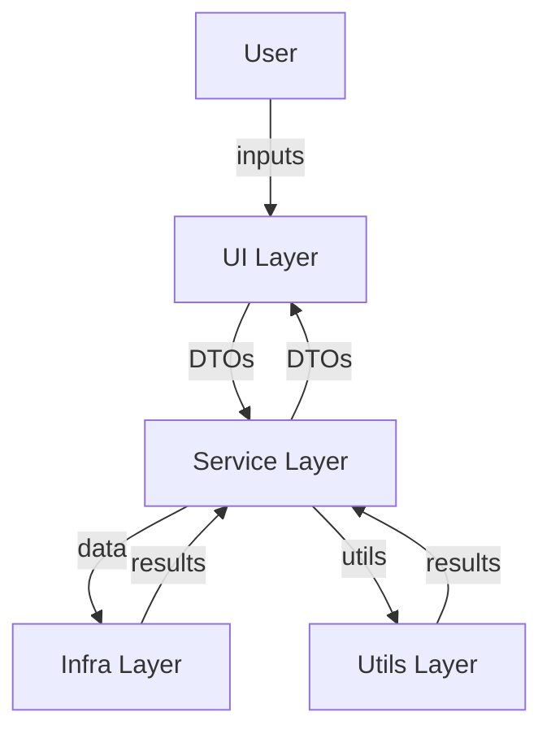

# OCCP Business Constraints Tool

## Overview
The OCCP Business Constraints Tool is a modular, maintainable web application for configuring, validating, and submitting business constraints for OCCP cycles. It features a modern UI, robust business logic, and seamless integration with Snowflake, email, and Excel export.

---

## Architecture

- **UI Layer (`ui/`)**: Streamlit-based forms and pages. Handles all user interaction. No business logic or data access.
- **Service Layer (`services/`)**: All business logic, validation, orchestration, and integration between UI and infra/utils.
- **Infra Layer (`infra/`)**: External integrations (Snowflake, email, Excel, API clients).
- **Utils Layer (`utils/`)**: Stateless, reusable utilities for data transformation, merging, mapping, and calculations.
- **Core Layer (`core/`)**: DTOs, base classes, and error definitions.
- **App Entrypoint (`app.py`)**: Orchestrates the UI flow and service calls.



---

## Quickstart

1. **Clone the repository:**
   ```sh
   git clone <repo-url>
   cd occp
   ```
2. **Install dependencies:**
   ```sh
   pip install -r requirements.txt
   ```
3. **Set up configuration:**
   - Place your Snowflake and email config files in the `config/` directory.
   - Ensure all required SQL files are in the `sql/` directory.
4. **Run the app:**
   ```sh
   streamlit run app.py
   ```

---

## Layer Descriptions

### UI Layer (`ui/`)
- Modular Streamlit forms for each step (market/brand, cycle, channel/capacity, HCP envelope).
- Uses DTOs for all data transfer.
- No business logic or data access.

### Service Layer (`services/`)
- All business logic, validation, and orchestration.
- Integrates with utils/utilization_automation and utils/output_mapping.
- Handles Excel/email orchestration.
- Central source for all UI dropdown/options (via `UIDataService`).

### Infra Layer (`infra/`)
- Centralized Snowflake data access (singleton connection).
- Email formatting and sending (modular, testable).
- Excel workbook generation (modular, testable).

### Utils Layer (`utils/`)
- Deep merge, Snowflake connection singleton, YAML/config utilities.
- Data mapping, value extraction, output DataFrame generation.
- Rep utilization calculations.

### Core Layer (`core/`)
- All DTOs for data transfer between layers.
- Abstract base classes for repo, exporter, email, etc.
- Custom exception classes and logging configuration.

---

## Adding New Features or Forms
- Create a new form in `ui/` for any new user input step.
- Add any new business logic to the appropriate service in `services/`.
- Use DTOs for all data transfer between layers.
- If new data is needed from Snowflake, add a method to `infra/snowflake_repo.py` and expose it via `UIDataService`.
- For new output formats, extend `infra/excel_exporter.py` or `infra/email_service.py` as needed.

---

## Testing
- Unit tests for infra and service layers are in `tests/`.
- To run all tests:
  ```sh
  pytest
  ```
- Add new tests for any new business logic or integrations.

---

## Further Documentation
- See [`docs/migration_status.md`](docs/migration_status.md) for a full migration audit and file-by-file breakdown.
- Inline docstrings and comments are provided throughout the codebase.

---

## Contribution Guidelines
- Fork the repo and create a feature branch for your changes.
- Write unit tests for any new logic.
- Ensure all code passes linting and tests before submitting a PR.
- Document any new modules or major changes in the README or migration status doc.

---

## Contact & Support
- For questions or support, contact the OCCP development team or open an issue in the repository.

---

**This project is designed for maintainability, testability, and extensibility. Welcome to the OCCP codebase!**
