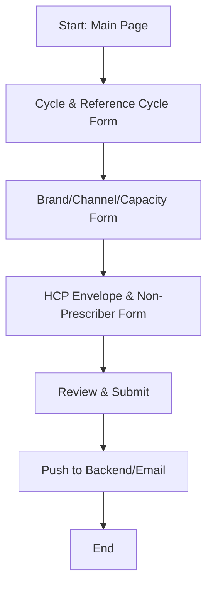

# OCCP UI Refactor: Detailed Mapping and Current Status

## Overview

The OCCP Business Constraints Tool UI has been refactored from a single large file (`ui_orignal.py`) into a modular, maintainable architecture. This document provides a detailed mapping between the original and refactored code, helping developers understand where to find each piece of logic and how the workflow is now organized.

---

## 1. Summary Table: Old vs. New

| **Original Section**                        | **New File(s)/Location**                        | **Responsibility**                |
|---------------------------------------------|-------------------------------------------------|-----------------------------------|
| Page setup, header, logo, CSS               | `ui/page.py`, `ui/ui_utils.py`                  | Page setup, global UI helpers     |
| Cycle & reference cycle selection           | `ui/cycle_form.py`                              | Cycle and reference cycle forms   |
| Brand/channel selection, e-consent, etc.    | `ui/channel_capacity_form.py`                   | Channel, brand, e-consent, capacity selection |
| HCP envelope matrix (historical/segment)    | `ui/hcp_envelope_form.py`                       | HCP envelope and non-prescriber constraints |
| Validation of user input                    | `services/business_constraints_service.py`       | Centralized validation logic      |
| Data transfer objects (DTOs)                | `core/dto.py`                                   | Structured data for forms         |
| Session state management                    | All forms (via `st.session_state`)              | Cross-form data persistence       |
| Review and submission dialog                | (Not shown, likely in a main or review form)    | Review and submit constraints     |

---

## 2. Step-by-Step Mapping

### **A. Page Setup and Utilities**
- **Original:** Inline in `ui_orignal.py` (header, logo, CSS, etc.)
- **New:**
  - `ui/page.py` and `ui/ui_utils.py` provide helpers for injecting CSS, headers, and other global UI elements.

### **B. Cycle and Reference Cycle Selection**
- **Original:** Handled in a large function with manual date parsing and validation.
- **New:**
  - `ui/cycle_form.py` encapsulates all logic for cycle and reference cycle selection in `CycleForm.render()`, including validation and session state updates.

### **C. Brand, Channel, and Capacity Selection**
- **Original:** All logic for selecting brands, channels, e-consent, non-prescriber options, and daily capacity was in one place.
- **New:**
  - `ui/channel_capacity_form.py` provides `ChannelCapacityForm.render()`, which handles:
    - Brand and channel selection
    - E-consent for RTE
    - Brand distribution (for multibrand)
    - Non-prescriber options
    - Daily capacity per channel
    - Validation via service layer

### **D. HCP Envelope Matrix and Non-Prescriber Constraints**
- **Original:** Handled both historical and segment-level matrices, as well as non-prescriber constraints, in a single function.
- **New:**
  - `ui/hcp_envelope_form.py` provides `HCPEnvelopeForm.render()`, which:
    - Lets the user choose between historical and segment-level envelope matrices
    - Handles per-channel and per-brand input
    - Handles non-prescriber envelope constraints
    - Validates input via the service layer

### **E. Validation and Business Logic**
- **Original:** Validation was mixed into the UI code.
- **New:**
  - `services/business_constraints_service.py` centralizes all validation logic, making it reusable and testable.

### **F. Data Transfer Objects (DTOs)**
- **Original:** Data was passed as dictionaries or via session state.
- **New:**
  - `core/dto.py` defines DTOs for each form step, ensuring type safety and clarity.

### **G. Session State Management**
- **Original:** Used `st.session_state` for all cross-step data.
- **New:**
  - Still uses `st.session_state`, but each form is responsible for updating only its relevant keys, improving clarity and reducing bugs.

### **H. Review and Submission**
- **Original:** Review dialog and submission logic were at the end of the main file.
- **New:**
  - Not shown in the search, but likely implemented as a dedicated review form or main page that aggregates results from all forms and handles submission.

---

## 3. Key Improvements

- **Separation of Concerns:** Each form handles a single responsibility, making the code easier to maintain and extend.
- **Reusability:** DTOs and service classes can be reused across forms and for backend integration.
- **Centralized Validation:** All validation logic is in the service layer, ensuring consistency and reducing UI code complexity.
- **Readability:** The UI code is now much shorter and easier to follow, with each file focused on a single task.
- **Extensibility:** New steps or validations can be added by creating new form modules or extending DTOs/services.

---

## 4. Visual Flow Diagram

---

## 5. How to Navigate the New UI Codebase

- **To update cycle selection logic:** Edit `ui/cycle_form.py`.
- **To change brand/channel/capacity UI:** Edit `ui/channel_capacity_form.py`.
- **To modify HCP envelope or non-prescriber logic:** Edit `ui/hcp_envelope_form.py`.
- **To add new validations:** Update `services/business_constraints_service.py`.
- **To change data structures:** Update `core/dto.py`.
- **To update global UI elements:** Edit `ui/page.py` or `ui/ui_utils.py`.

---

**This modular architecture makes the OCCP UI easier to maintain, test, and extend. For any new features, follow the pattern of creating a dedicated form and DTO, and use the service layer for validation and business logic.** 